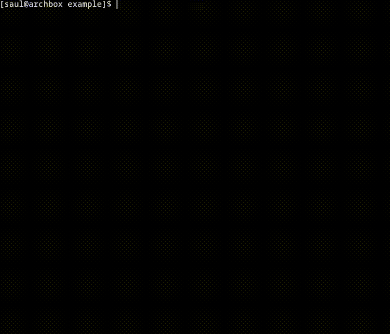

# bubbletea-modal



A modal component that can be used to create dialogs and popups in your TUI.

## Versions
- **bubbletea-modal (v1)**: Lipgloss/Bubble Tea v1 (before the Compositing API)
- **bubbletea-modal/v2**: Lipgloss/Bubble Tea v2 (uses `lipgloss.NewLayer()`)

## Features
- **Satisfies `tea.Model`**: familiar API for initialisation and updates.
- **ANSI-aware**: preserves colour and text style passed in from Lipgloss or other ANSI style libraries.
- **Positionable**: supports `lipgloss.Position` positioning on both axes.
- **Toasts and Notifications**: easily configure the `modal.Model` to close itself.
- **Stackable**: `modal.Model` accepts the View() of other `modal.Model` as a background.
- **OSC-8 support**: "non-typical" sequences such as OSC-8 URLs are supported.

## Usage Example
```go
func dialogContent() string {
	message := lipgloss.NewStyle().Margin(2).PaddingBottom(2).Render("Are you sure you want to quit?")
	confirm := lipgloss.NewStyle().MarginRight(2).Render("Confirm Y")
	cancel := lipgloss.NewStyle().Render("Cancel N")

	joined := lipgloss.JoinVertical(
		lipgloss.Center,
		message,
		lipgloss.JoinHorizontal(lipgloss.Center, confirm, cancel),
	)

	return lipgloss.NewStyle.Border(lipgloss.RoundedBorder()).Render(joined)
}

modal := modal.New(
	WithPosition(lipgloss.Center, lipgloss.Center),
	WithForeground(dialogContent),
	WithDimmedBackground(true),
	WithKeymap("enter", "esc"),
	WithConfirmCmd(func() tea.Msg { return modal.ConfirmMsg })
)

// ... then in our parent Update():
m.modal.Open(parentModel.View())
```

## Usage Notes
- `modal` operates on a snapshot basis: its `Open()` method expects a string background (usually the `View()` of the parent component).
- `onOpen()/onConfirm()`/`onClose()` behaviour is injectable at creation time.
- The default `onConfirm()` behaviour is to return nil. The default `onClose()` behaviour is to close (stop displaying the modal) and return nil (this is often enough for most uses, but is left open to more complex behaviour).

## Roadmap
- Finer control over positioning - expose x/y translation 
- Mouse events (e.g. click outside -> close the dialog)
